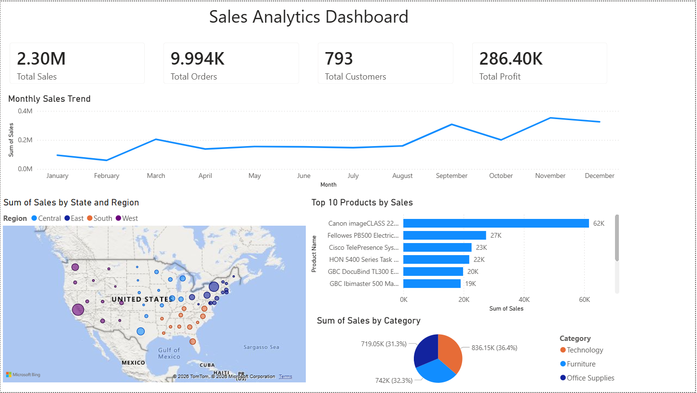

# Sales Analytics Dashboard

## Key Highlights

- Built an interactive **Power BI dashboard** to analyze sales performance.
- Implemented KPI metrics including **Total Sales, Orders, Customers, and Profit**.
- Visualized **monthly sales trends, top-selling products, and geographic sales distribution**.
- Enabled business insights through **data visualization and analytics**.

This project presents a Sales Analytics Dashboard built using Power BI to analyze sales performance, product trends, and regional distribution.

## Tools & Technologies

- Power BI
- Python (Pandas)
- Data Visualization
- Business Intelligence
- Kaggle Superstore Dataset

## Dashboard Features
- Total Sales, Orders, Customers, and Profit KPIs
- Monthly Sales Trend analysis
- Sales distribution by state and region (Map visualization)
- Top 10 best-selling products
- Sales contribution by category

## Insights
- Identifies best-performing products
- Highlights regional sales performance
- Tracks monthly sales growth

## Files
- `sales_analytics_dashboard.pbix` – Power BI dashboard
- `clean_sales_data.csv` – Processed dataset
- `dashboard_screenshot.png` – Dashboard preview
